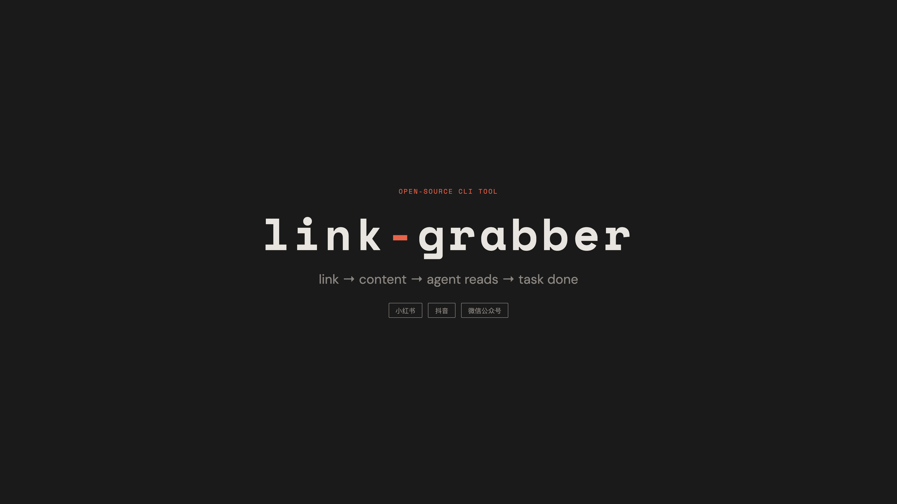

# link-grabber 🔗

[](https://www.python.org/downloads/)
[](LICENSE)
[](https://github.com/astral-sh/uv)

**Turn social media links into AI-agent-readable context packs.**

小红书 · 抖音 · 微信公众号 — one CLI, three platforms, any agent.

📖 [查看简体中文文档](README.zh.md)



## Why link-grabber?

Your AI agent can't read links. Paste a Douyin video URL into Claude, ChatGPT, or any agent — it sees nothing. You end up manually copying text, screenshotting images, summarizing videos yourself, then feeding it all back.

**link-grabber automates the entire pipeline.** One command extracts text, images, video keyframes, and speech transcription into a structured context pack your agent can directly consume.

<!-- SCREENSHOT: 02-pain.png -->

### What makes it different

| Feature | link-grabber | MediaCrawler | wechat-article-to-markdown | MarkItDown |
|---------|:---:|:---:|:---:|:---:|
| Multi-platform (XHS + Douyin + WeChat) | ✅ | ✅ | ❌ WeChat only | ❌ Generic web |
| LLM-ready Markdown output | ✅ | ❌ CSV/JSON | ✅ | ✅ |
| Video keyframe extraction | ✅ | ❌ | ❌ | ❌ |
| Speech transcription (Whisper) | ✅ | ❌ | ❌ | ✅ (audio files) |
| Unified context pack | ✅ | ❌ | ❌ | ❌ |
| AI agent integration (Skill) | ✅ | ❌ | ✅ | ❌ |

<!-- SCREENSHOT: 03-platforms.png -->

## ✨ Features

- 📕 **小红书** — 图文笔记 + 视频，通过 XHS-Downloader 引擎抽取
- 🎵 **抖音** — 视频关键帧 + Whisper 语音转录，通过 Douyin API 引擎
- 💬 **微信公众号** — Playwright 渲染抽取，支持新旧两版图文格式
- 🎬 **视频理解** — ffmpeg 抽取关键帧 + OpenAI Whisper 转录，10 分钟视频 → 2 分钟掌握
- 📦 **Context Pack** — `manifest.md` + 图片 + 视频帧 + 转录文本，agent 直接读取
- 📝 **Obsidian 存档**（可选）— `--save-obsidian` 自动 AI 分类摘要写入 Obsidian
- 🔒 **无登录** — 全程不发送平台 Cookie，公众号使用住宅 IP 限速

## 📋 Requirements

- Python 3.12+
- [uv](https://github.com/astral-sh/uv) (package manager)
- [ffmpeg](https://ffmpeg.org/) (video frame extraction)
- [OpenAI API key](https://platform.openai.com/) (Whisper transcription, optional with `--no-transcript`)

## 📦 Installation

```bash
git clone https://github.com/Phat-Po/link-grabber.git
cd link-grabber
uv sync
uv run playwright install chromium
```

## 🚀 Quick Start

```bash
# Grab a Xiaohongshu post
uv run grab "http://xhslink.com/o/3GATQJP3HgA"

# Grab a Douyin video (skip transcription to save cost)
uv run grab "https://v.douyin.com/16opyW1Vvmo/" --no-transcript

# Grab a WeChat article
uv run grab "https://mp.weixin.qq.com/s/Oo0iksfTXvUSFNnBrWOOpw"

# Output as JSON (for piping)
uv run grab "<url>" --json
```

<!-- SCREENSHOT: 04-how.png -->

## 📦 Output Structure

Each grab produces a **context pack** in `~/.cache/link-grabber/<platform>_<id>/`:

```
xhs_3gatqjp3hga/
├── manifest.md          # Structured summary (agent reads this first)
├── caption.md           # Original title + description
├── 01.jpg               # Extracted images
├── 02.jpg
├── frame_001.jpg        # Video keyframes (if video)
├── frame_002.jpg
└── transcript.txt       # Whisper transcription (if video + API key)
```

Your agent should read `manifest.md` first, then view listed images and frames.

## ⌨️ CLI Options

```
uv run grab <urls...> [OPTIONS]

Arguments:
  urls               One or more XHS, Douyin, or WeChat URLs

Options:
  --no-transcript    Skip Whisper transcription (save API cost)
  --no-frames        Skip ffmpeg frame extraction
  --save-obsidian    Also summarize and save to Obsidian
  --out PATH         Custom output directory
  --json             Print machine-readable manifest summary
```

## 🔧 Configuration

Copy `.env.example` to `.env` and fill in:

```bash
# Required for video transcription
OPENAI_API_KEY=sk-xxx

# Optional: Obsidian archive (only with --save-obsidian)
OBSIDIAN_API_KEY=xxx
OBSIDIAN_PORT=27123

# Optional: model overrides
OPENAI_MODEL=gpt-4o-mini
WHISPER_MODEL=whisper-1
```

<!-- SCREENSHOT: 05-quickstart.png -->

## 🛠️ Troubleshooting

**Playwright fails to install:**
```bash
uv run playwright install chromium --with-deps
```

**ffmpeg not found:**
```bash
# macOS
brew install ffmpeg

# Ubuntu/Debian
sudo apt install ffmpeg
```

**WeChat "环境异常" error:**
WeChat may block automated access. This tool uses residential IP rate-limiting. If blocked, wait and retry later.

## 🛠️ Development

```bash
uv sync --group dev
uv run ruff check src/
uv run pytest
```

## 📄 License

[MIT](LICENSE) © 2026 [Phat-Po](https://github.com/Phat-Po)

---

> Built for AI agents that need to understand the Chinese internet.
> Star ⭐ if link-grabber saves you time.
